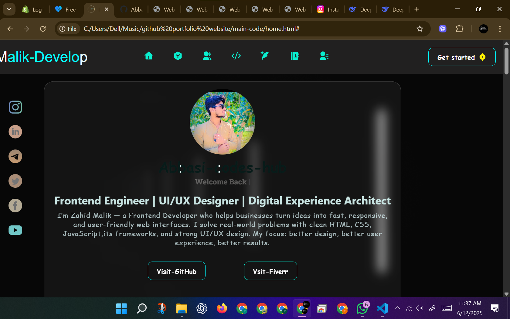
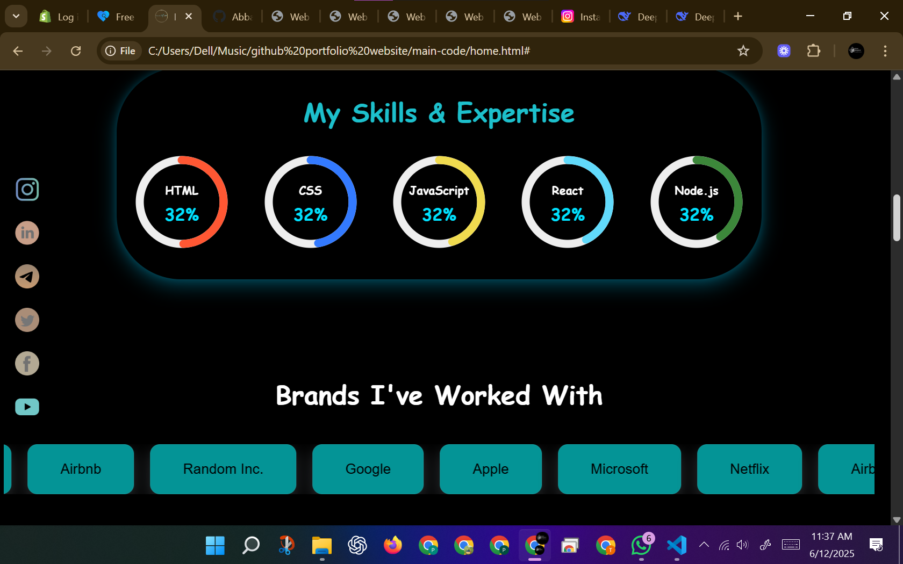
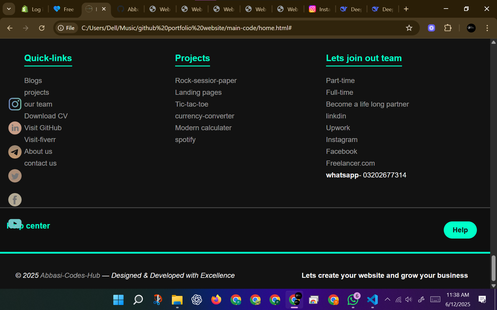

# Abbasi-codes-hub-porfolio-webpage-landscapes
A portfolio webpage just for practice only for landscapes devices . You can use it.
# Landscape-Only GitHub Portfolio Website 🌄💻

This is a responsive developer portfolio website **exclusively optimized for landscape devices** such as tablets, laptops, and desktops.

## 🌟 Features

- Landscape device-friendly layout
- Multiple HTML section pages
- Clean structure with folders

## 📸 Screenshots

## 📁 Folder Structure

- `about us/` - About page  
- `contact-us/` - Contact form  
- `projects/` - Your projects  
- ...etc

## ⚠️ Note

🚫 Not for portrait mobile users.  
✅ Best viewed in landscape mode. mostly but its a only dumy project.

---

Made with 💙 by Samar Abbasi
